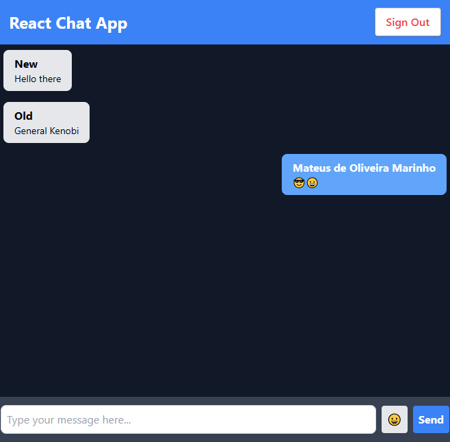

<h1>Realtime Chat App</h1>

This is a Realtime Chat Application built with React and Firebase. It allows users to create an account, log in and start chatting with other users in real time.

<h2>Features</h2>
<ul>
  <li>User authentication with email and password or Google sign-in.</li>
  <li>Realtime chat with other authenticated users.</li>
  <li>Ability to send and receive messages in real time.</li>
  <li>Responsive design for use on desktop and mobile devices.</li>
  <li>User can see when other users are online or offline.</li>
  <li>Clean and simple user interface.</li>
</ul>
<h2>Installation</h2>
<ol>
  <li>Clone this repository to your local machine.</li>
  <li>Install the dependencies using <code>npm install</code>.</li>
  <li>Create a Firebase account and a new project.</li>
  <li>Go to the Firebase console and create a new Web App.</li>
  <li>Copy the Firebase configuration details and add them to your project.</li>
  <li>Enable email and password authentication and Google authentication in your Firebase project.</li>
  <li>Create a firebase.js file in the config folder and export the Firebase configuration details as shown below:</li>
</ol>

javascript

Copy code

import { initializeApp } from 'firebase/app';

import { getFirestore } from 'firebase/firestore';

import { getAuth } from 'firebase/auth';

const firebaseConfig = {
  // Add your Firebase configuration details here
};

const app = initializeApp(firebaseConfig);

const db = getFirestore(app);

const auth = getAuth(app);

export { db, auth };

<ol start="8">
  <li>Start the application using <code>npm start</code>.</li>
</ol>
<h2>Usage</h2>
<ul>
  <li>Navigate to the login page to create an account or log in using an existing account.</li>
  <li>Once logged in, the user will be directed to the chat room where they can start sending and receiving messages in real time.</li>
  <li>Click on the "Logout" button to log out of the application.</li>
</ul>
<h2>Technologies Used</h2>
<ul>
  <li>React</li>
  <li>Firebase Authentication</li>
  <li>Firebase Realtime Database</li>
  <li>Tailwind CSS</li>
</ul>

<h1>Screenshot:</h1>
